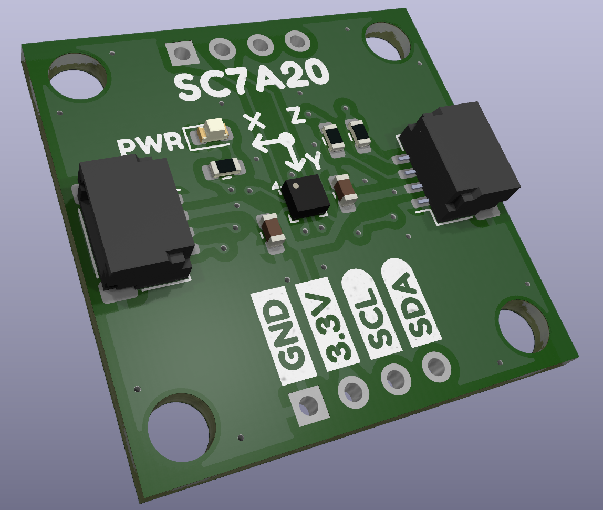
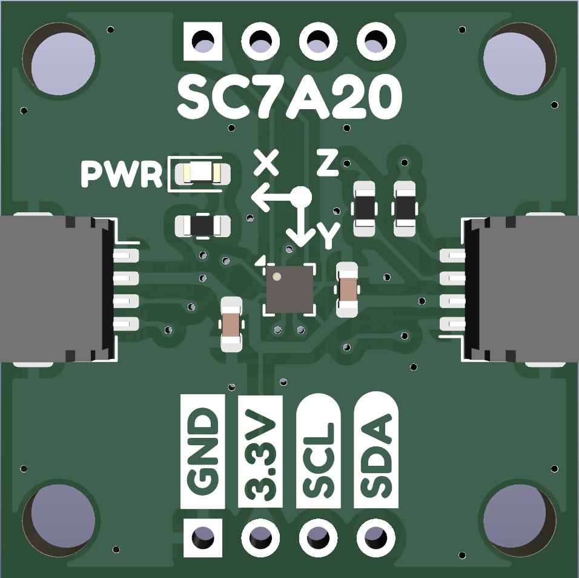
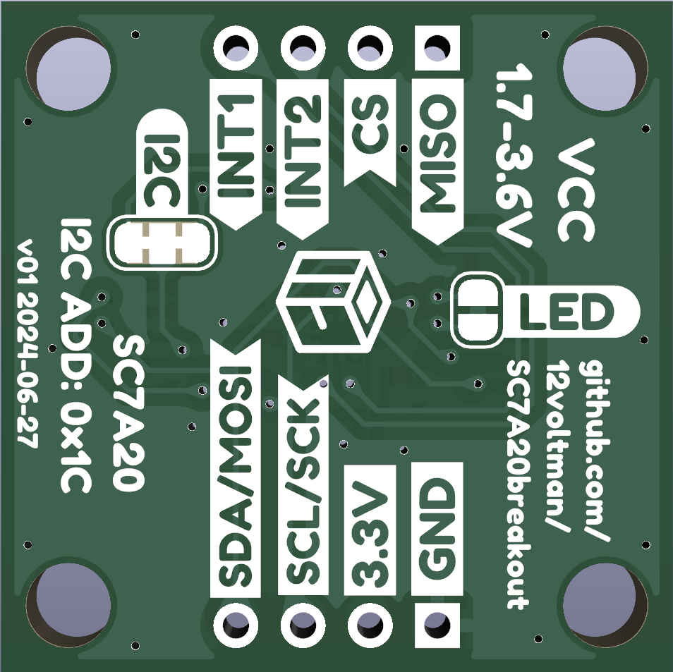

</img>
# SC7A20breakout
Breakout for the SC7A20 low-cost 3-axis accelerometer  
## Features
- 12-bit range
- ±2G, ±4G, ±8G, ±16G selectable range
- 1-400Hz poll rate
- 1.7-3.6V operating voltage
- I2C/SPI/3-Wire SPI selectable interface
- 2 independent interrupts
- On-board 10k I2C pullups (cut jumper to disable)
- On-board power LED (cut jumper to disable)  
</img> </img>
